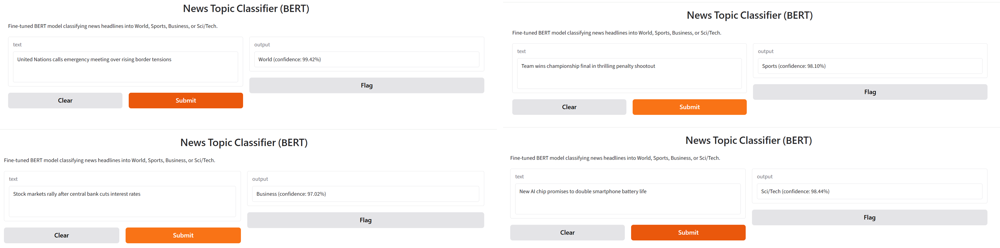

# 🧠 AI/ML Engineering — Advanced Internship, Phase 2
### DevelopersHub Corporation

**Five end-to-end AI systems — built, broken, debugged, and shipped.**

*NLP · Machine Learning Pipelines · Multimodal Deep Learning · Retrieval-Augmented Generation · LLM Prompt Engineering*

---

## 🎯 What This Repo Is

This is my submission for **Phase 2** of the DevelopersHub AI/ML Engineering Internship — five independent, production-style AI projects, each tackling a different corner of modern machine learning. The internship asked for at least 3 of 5 tasks; **all 5 are complete**, deployed, and documented here.

Every project follows the same philosophy: **don't just make it work once — make it work reliably.** Several notebooks below include an explicit "Engineering Notes" section documenting real bugs hit during development (library version mismatches, dataset hosting changes, memorization vs. generalization pitfalls) and how they were diagnosed and fixed. That debugging trail is left in on purpose — it's as much a part of the deliverable as the models themselves.

---

## 🗺️ The Five Projects

| # | Project | What It Does | Core Tech | Status |
|---|---------|---------------|-----------|:------:|
| 1 | 📰 **News Topic Classifier** | Classifies news headlines into World / Sports / Business / Sci-Tech | Fine-tuned BERT, Gradio | ✅ |
| 2 | 🔄 **End-to-End ML Pipeline** | Predicts customer churn from a single reusable pipeline object | scikit-learn `Pipeline`, `GridSearchCV`, `joblib` | ✅ |
| 3 | 🏠 **Multimodal Housing Price Predictor** | Predicts home prices by fusing photos *and* structured data | CNN + tabular fusion (Keras/TensorFlow) | ✅ |
| 4 | 💬 **Context-Aware RAG Chatbot** | Answers questions with memory, grounded in a real knowledge base | Sentence embeddings, FAISS, FLAN-T5, Streamlit | ✅ |
| 5 | 🏷️ **Auto-Tagging Support Tickets** | Tags tickets with the top-3 likely categories | Zero-shot, few-shot & fine-tuned LLM comparison | ✅ |

---

## 📰 Task 1 — News Topic Classifier (BERT)

Fine-tuned `bert-base-uncased` on the AG News dataset to classify headlines into 4 topics, then shipped as a live Gradio app.

| Test Headline | Predicted | Confidence |
|---|---|---|
| *"United Nations calls emergency meeting over rising border tensions"* | World | 99.42% |
| *"Team wins championship final in thrilling penalty shootout"* | Sports | 98.10% |
| *"Stock markets rally after central bank cuts interest rates"* | Business | 97.02% |
| *"New AI chip promises to double smartphone battery life"* | Sci/Tech | 98.44% |

📓 [`Task1_News_Topic_Classifier_BERT.ipynb`](./Task1_News_Topic_Classifier_BERT.ipynb)

---

## 🔄 Task 2 — End-to-End ML Pipeline (Customer Churn)

A single `scikit-learn Pipeline` object that takes raw customer data in and predicts churn out — no manual preprocessing step required. Two models (Logistic Regression, Random Forest) tuned via `GridSearchCV` and compared on Accuracy, Precision, Recall, and F1; the winner is exported with `joblib` and reloaded to prove it works on unseen data with zero extra setup.

📓 [`Task2_ML_Pipeline_Churn_Prediction.ipynb`](./Task2_ML_Pipeline_Churn_Prediction.ipynb)

---

## 🏠 Task 3 — Multimodal Housing Price Prediction

Most price predictors only look at spreadsheets. This one also *looks at the house.* Four photos per property (bedroom, bathroom, kitchen, frontal) are combined into a single montage and fed through a CNN branch; that's fused with an MLP branch processing bedrooms/bathrooms/area/zip code, and the two streams jointly predict price — evaluated with MAE and RMSE in real dollar terms.

📓 [`Task3_Multimodal_Housing_Price_Prediction.ipynb`](./Task3_Multimodal_Housing_Price_Prediction.ipynb)

---

## 💬 Task 4 — Context-Aware Chatbot (RAG)

A chatbot that doesn't hallucinate and doesn't forget. Built as a full Retrieval-Augmented Generation pipeline **from first principles** — `sentence-transformers` for embeddings, `FAISS` for vector search, `FLAN-T5` for generation — with a lightweight conversation-memory layer so follow-up questions using "it" or "that" resolve correctly. Deployed live via Streamlit + a public tunnel, directly from Colab.

> **Engineering note:** this task went through several iterations — an early version used the LangChain framework, but repeated breaking changes across LangChain/Transformers versions (shifting import paths, pipeline registries) made it fragile. The final version implements retrieval, generation, and memory directly against stable, low-level libraries instead — same RAG concept, far fewer moving parts to break.

📓 [`Task4_Context_Aware_Chatbot_RAG.ipynb`](./Task4_Context_Aware_Chatbot_RAG.ipynb)

---

## 🏷️ Task 5 — Auto-Tagging Support Tickets (LLM)

Three different ways to get an LLM to tag a support ticket, benchmarked head-to-head on the *same* held-out tickets:

| Approach | Accuracy | Why |
|---|:---:|---|
| **Zero-Shot** (`bart-large-mnli`) | 65.0% | No training data needed — surprisingly solid out of the box |
| **Few-Shot** (`flan-t5-base`, in-context) | 45.0% | Generative + free-text matching is brittle for strict classification |
| **Fine-Tuned** (`distilbert-base-uncased`) | **80.2%** | Best performer — direct supervision wins, as expected |

> **Evaluation note:** the train/test split is done at the *template* level — a few phrasing patterns per tag are held out entirely from training and only ever appear in testing. This was a deliberate fix after an early version of this experiment scored a suspicious 100%, which turned out to be the model memorizing repeated sentence structures rather than actually generalizing. The numbers above are the honest, corrected result.

The final tagger returns the **top 3 most probable tags** with confidence scores, and is deployed as a live Gradio demo:

📓 [`Task5_Auto_Tagging_Support_Tickets_LLM.ipynb`](./Task5_Auto_Tagging_Support_Tickets_LLM.ipynb)

---

## 🧰 Tech Stack

**Modeling:** `BERT` · `DistilBERT` · `FLAN-T5` · `BART (zero-shot NLI)` · CNNs (`TensorFlow/Keras`) · `scikit-learn`

**Infrastructure:** `Hugging Face Transformers` · `FAISS` · `sentence-transformers` · `GridSearchCV` · `joblib`

**Deployment:** `Gradio` · `Streamlit` + `localtunnel`

---
## ✅ Submission Checklist

- [x] All 5 tasks completed (internship required a minimum of 3)
- [x] Each notebook: problem statement → preprocessing → training/build → evaluation → insights
- [x] Clean, commented, reproducible code — every notebook runs top-to-bottom with zero manual downloads
- [x] Live demos deployed (Gradio ×2, Streamlit ×1)
- [x] Dedicated README covering all 5 tasks with results, screenshots, and engineering notes
- [ ] Submitted via Google Classroom

---

**Author:** **(Maryam Saif)**

AI/ML Engineering Intern @ DevelopersHub Corporation · Advanced Task Set, Phase 2
📅 Due 14 July 2026

⭐ *If you're a reviewer skimming this — Task 4 and Task 5's "Engineering Notes" sections are probably the most interesting things here.*

